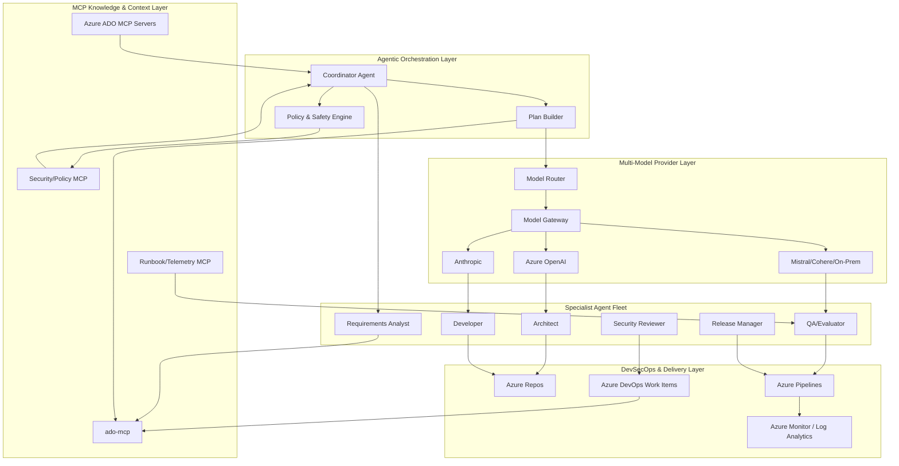

# Sample AI SDLC Patterns with Azure

## Overview
This repository documents a **modern, agentic AI Software Development Lifecycle (SDLC) architecture** for Azure that mirrors the intent of the AWS sample design while adapting the system to Azure-native services, Azure DevOps, and Model Context Protocol (MCP) servers. The goal is to enable **multi-model LLM development**, robust requirements/issue management, and auditable operations across the entire delivery lifecycle.

The design uses:
- **Azure DevOps Model Context Protocol (MCP) Server (ado-mcp)** as the authoritative context for projects, work items, and knowledge.
- **Azure ADO MCP servers** for cross-project knowledge and portfolio operations.
- **Other MCP servers** to ingest domain knowledge, security policies, and runtime operational signals.
- **Agentic orchestration** to coordinate multiple LLM providers (OpenAI, Anthropic, Cohere, Mistral, etc.) with well-defined roles and routing policies.

## Goals
- Provide a reusable **AI SDLC system architecture** for Azure.
- Support **multi-model LLM providers** with routing, evaluation, and safety controls.
- Treat **ADO work items** as the system-of-record for requirements, issues, and decisions.
- Integrate **MCP servers** for knowledge, telemetry, and governance.
- Offer **modern, cloud-native architecture** with secure operations and traceable workflows.

---

## Reference Mapping from AWS Design
The AWS reference design uses agentic orchestration, model routing, and lifecycle automation. The Azure adaptation maps core concepts as follows:

| AWS Pattern | Azure Equivalent | Purpose |
| --- | --- | --- |
| AWS CodeCommit / CodeBuild / CodePipeline | Azure Repos / Azure Pipelines | CI/CD and source control |
| Amazon Bedrock | Azure OpenAI + Multi-provider gateways | LLM hosting and access |
| AWS Lambda / Step Functions | Azure Functions / Durable Functions | Orchestration and task execution |
| AWS CloudWatch | Azure Monitor / Log Analytics | Telemetry and observability |
| AWS IAM | Azure Entra ID / RBAC | Access control |
| AWS Sample LLM Ops | Azure ML + Prompt Flow + Eval | Model lifecycle management |

---

## Architecture Overview

### 1. Core System Components

**A. Agentic Orchestration Layer**
- **Coordinator Agent**: receives tasks from users or pipelines, builds execution plans, delegates to specialized agents.
- **Specialist Agents**: requirements analyst, architect, developer, security reviewer, QA/evaluator, release manager.
- **Policy & Safety Engine**: enforces data boundaries, model usage rules, and compliance controls.

**B. Multi-Model Provider Layer**
- **Model Router** decides which model to use based on task type, cost, latency, risk.
- **Provider Adapters** for Azure OpenAI, Anthropic, Mistral, Cohere, or on-prem models.
- **Evaluation & Benchmarking** to monitor quality and drift across models.

**C. MCP Knowledge & Context Layer**
- **ado-mcp (Azure DevOps MCP Server)** for:
  - Projects, repos, pipelines, work items
  - Requirements analysis artifacts and task breakdowns
  - Issue management and audit history
- **Azure ADO MCP servers** for cross-portfolio visibility and shared context.
- **Other MCP servers** for security policies, architecture standards, runbooks, and telemetry.

**D. DevSecOps Layer**
- Azure Pipelines integrates with MCP to attach AI-generated artifacts to work items.
- Security scanning, policy checks, and compliance gates enforced before merge.

---

## System Diagrams

### High-Level System Diagram

```mermaid
flowchart LR
    User[Users & Pipelines] --> Coordinator[Coordinator Agent]
    Coordinator --> Policy[Policy & Safety Engine]
    Coordinator --> Requirements[Requirements Agent]
    Requirements --> ADO[ado-mcp / Azure ADO MCP Servers]
    Coordinator --> Router[Model Router]
    Router --> Providers[LLM Providers\nAzure OpenAI | Anthropic | Cohere | Mistral]
    Providers --> Agents[Specialist Agents\nArchitect | Dev | Security | QA | Release]
    Agents --> DevOps[Azure Repos / Pipelines / Work Items]
    DevOps --> Telemetry[Azure Monitor / Log Analytics]
```

### Low-Level System Diagram



### 2. System Flow

1. **Initiate request**: A product owner or engineer submits a work item in Azure DevOps.
2. **Context ingestion**: Coordinator agent queries ado-mcp for project knowledge, requirements, and current issues.
3. **Plan & task breakdown**: Requirements agent produces a structured plan (linked to ADO work items).
4. **Model routing**: Router selects best LLM provider per task (design, code, review, test).
5. **Execution**: Specialist agents generate design docs, code changes, and test strategies.
6. **Evaluation**: QA agent validates outputs with automated checks and LLM-based review.
7. **Governance**: Policy engine enforces access, compliance, and audit trails in ADO.
8. **Release**: Release manager agent updates pipelines and deployment gates.

---

## Reference Architecture Diagram (Textual)

```
[User / Pipeline]
      |
      v
[Coordinator Agent] ---> [Policy & Safety Engine]
      |
      v
[Requirements Agent] -- queries --> [ado-mcp / ADO MCP servers]
      |
      v
[Model Router] ---> [LLM Providers: Azure OpenAI | Anthropic | Cohere | Mistral]
      |
      v
[Specialist Agents: Architect | Dev | Security | QA | Release]
      |
      v
[Azure Pipelines / Repos / Work Items]
      |
      v
[Telemetry: Azure Monitor / Log Analytics]
```

---

## Detailed Requirements & Issue Management (ADO-MCP)

**ADO Work Items as System of Record**
- Requirement epics, features, user stories, and bugs live in Azure DevOps.
- Each AI-generated artifact is attached to its work item.
- MCP servers provide real-time retrieval of requirement context and issue dependencies.

**Example ADO MCP Queries**
- Fetch current sprint requirements
- Retrieve open security issues
- Pull acceptance criteria and definition-of-done for a user story

---

## Agentic Roles & Responsibilities

| Agent | Responsibilities | MCP Dependencies |
| --- | --- | --- |
| Coordinator | Task routing, orchestration, governance | ado-mcp, policy MCP |
| Requirements Analyst | Requirements decomposition, traceability | ado-mcp |
| Architect | Solution design, diagramming | ado-mcp, architecture MCP |
| Developer | Code generation, refactors | ado-mcp, repo MCP |
| Security Reviewer | Threat modeling, compliance | security MCP |
| QA/Evaluator | Test planning, LLM evals | ado-mcp, telemetry MCP |
| Release Manager | Deployment planning, rollout gates | ado-mcp, pipelines MCP |

---

## Multi-Model Provider Strategy

- **Routing policies** based on:
  - Complexity (e.g., architecture tasks to higher-quality models)
  - Risk (security reviews require most reliable models)
  - Cost (low-risk tasks use cheaper models)
  - Latency (fast models for interactive use cases)

- **Fallbacks** for outages or errors.
- **Evaluation harness** to compare providers on internal benchmarks.

---

## Governance, Safety, and Compliance

- **Data Residency**: Azure region-based routing.
- **PII Controls**: redaction and policy filters before LLM calls.
- **Auditability**: all agent decisions logged to Azure DevOps work items.
- **Security**: integrate Azure Policy, Defender for Cloud, and identity-based access.

---

## Suggested Implementation Phases

1. **Phase 1: Foundation**
   - Establish ado-mcp and ADO MCP servers.
   - Create agentic orchestration baseline.
   - Integrate Azure OpenAI + one secondary provider.

2. **Phase 2: Scale**
   - Add more MCP sources (security, compliance, telemetry).
   - Introduce evaluation harness and model routing policies.

3. **Phase 3: Automation**
   - Automate work item creation, requirement analysis, and release gating.
   - Connect pipelines for continuous AI-driven feedback.

---

## Deliverables
- Architecture overview documentation (this README).
- Reference agent roles and workflows.
- Guidance for integrating ado-mcp and multi-provider LLM routing.

---

## Next Steps
- Implement ado-mcp server connectivity.
- Build a minimal orchestration service (Azure Functions + Durable Functions).
- Configure model gateway for Azure OpenAI + external providers.
- Automate DevOps pipelines for end-to-end AI SDLC workflows.
